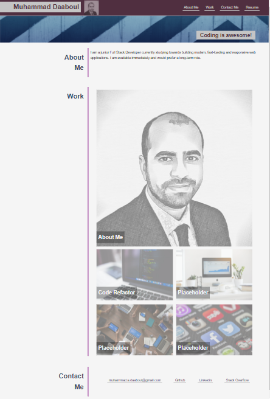

# My Portfolio
> My Portfolio
> Live demo [_here_](https://moedaaboul.github.io/02_Portfolio/). 

## Table of Contents
* [General Info](#general-information)
* [Technologies Used](#technologies-used)
* [Mock-up Appearance](#mock-up-appearance)
* [Appearance](#appearance)
* [Features](#features)
* [Setup](#setup)
* [Project Status](#project-status)
* [Room for Improvement](#room-for-improvement)
* [Contact](#contact)
* [License](#license)

## General Information
My career advisor has tasked me to start building my portfolio page using the technologies learned so far. Goal is to address and meet the following criteria:

- Presents my name, a recent photo, a link to a section about me, my work and contact details
- Navigation links scrolls to the corresponding section
- Work link under the navigation bar scrolls to a section with titled images of my developed applications
- First image under Work section should be larger in size than the others
- Images when clicked take the user to the deployed application
- The page has a responsive layout that adapts to various screens and devices

No starter code was provided for the purposes of completing this web application.

## Technologies used
Have used the following technologies only: 

- HTML5
- CSS3

## Mock-up Appearance
The following gif is the mock-up piece which depicts the functionality and output expected of my webpage: 

## Appearance
The following gif is the mock-up piece which depicts the functionality and output expected of my webpage: 

## Features

Additional feature adds a profile picture to the header section
Additional styling to achieve a much closer feel to the gif mock-up

## Setup
- Text editor (VS Code recommended)
- An Internet browser

## Project Status
Project is: _complete_. 

## Room for Improvement

This layout is designed for Google Chrome viewing, so you may notice that some of the elements don't look like the mock-up using different browsers. The webpage can be improved to make elements responsive so that the web application is optimized for any browser.

Some placeholders have also been added and will be updated later upon finalising further web applications.

## Contact
Created by [@moedaaboul](https://github.com/moedaaboul) - feel free to contact me!

## License
This work is licensed under a
[Creative Commons Attribution 4.0 International License][cc-by].

Shield: [![CC BY 4.0][cc-by-shield]][cc-by]
  
[![CC BY 4.0][cc-by-image]][cc-by]

[cc-by]: http://creativecommons.org/licenses/by/4.0/
[cc-by-image]: https://i.creativecommons.org/l/by/4.0/88x31.png
[cc-by-shield]: https://img.shields.io/badge/License-CC%20BY%204.0-lightgrey.svg

